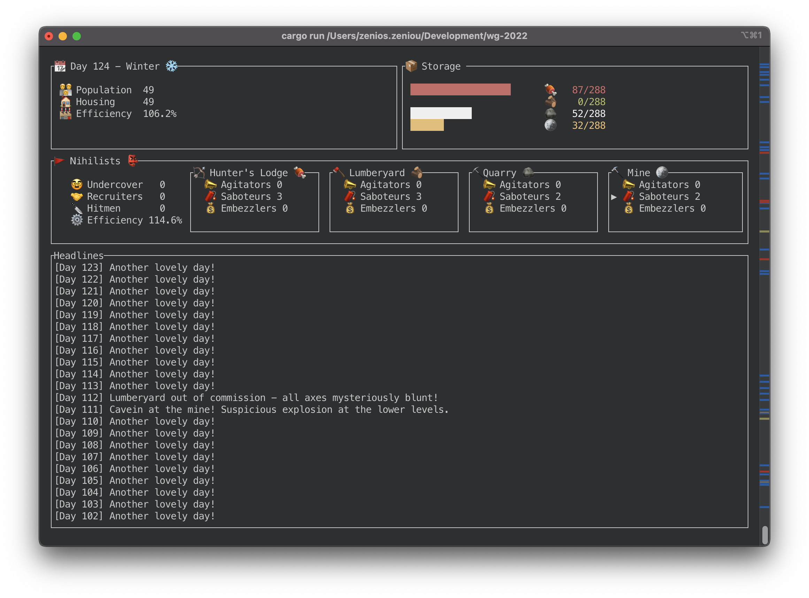

# Nihilists

A real-time strategy game for the command line.



* The civilization depends on four resources:
  * 🍖 Food keeps the population alive and drives growth
  * 🪵 Wood leads to more housing
  * 🪨 Stone increases storage capacity
  * 🪙 Iron leads to better tools, increasing overall productivity

* Strategically position your comrades to affect maximum carnage!
  * 📣 Extol the virtues of [UBI](https://en.wikipedia.org/wiki/Universal_basic_income) and watch productivity plummet
  * 🥸 Stay undercover and assist the rest of your comrades
  * 🤝 Recruit citizens to your nefarious cause
  * 🔪 Send hitmen to “take out the trash”
  * 🧨 Sabotage one of four production locations
  * 💰 Embezzle resources

## Install

Install:

```
cargo install --git https://github.com/mrzenioszeniou/nihilists
```

Uninstall:

```
cargo uninstall nihilists
```

## Usage

To start:

```
nihilists
```

* Move around using arrow keys.
* Press `+`/`-` to change the number of allotted nihilists.
* Press `Q` to exit.

## Contributing

Sure, but why?

## License

MIT © [Zenios Zeniou](LICENSE)
